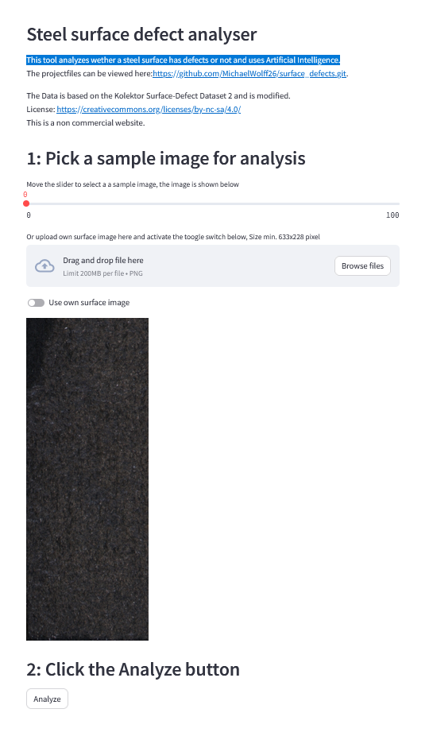

# surface_defects

This tool analyzes wether a steel surface has defects or not and uses Artificial Intelligence. It is based on images from the steel surfaces, that are further analyzed.

# program elements:

- "training.ipynb" in the notebooks folder: The AI is trained in this jupyter notebook. Here it is possible to choose different models (Code for the models is in the detector folder), analyze the results with a confusion matrix and save the model parameters to a file. An own .venv is created with poetry for the notebook.

- "FastAPI.py" in the backend/backend folder: This file provides the backend of the webpage. It features FastAPI and is a post request based backend, that analyzes image data with the saved model parameters and sends the result back to the frontend. An own .venv is created with poetry for FastAPI.py.

- "Streamlit_GUI.py" in the frontend/frontend folder: This file is the web-frontend, created with streamlit. It sends the image data to the backend and presents its results. It also features its own .venv, created with poetry.

- "Dockerfiles + docker-compose.yml". Backend and frontend are created as docker images. Furthermore an nginx docker image is used to manage SSL certificates.

# Screenshoot of the frontend:

